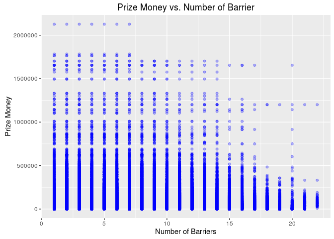
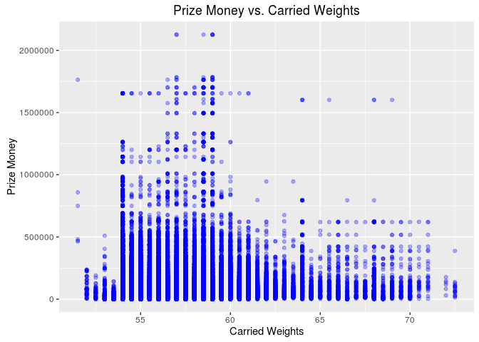

# Horse Racing: What Affacts Winning? (I)
Yanfei Wu  
August 28, 2016  


## Introduction  

Horse racing is a performance sport that can be dated back to ancient times, e.g., Ancient Greece and Egypt. But nowerdays, the major interest in horse racing lies in the fact that it is associated with gambling. This also affords horse racing great economic importance. Like many other risk-return oprions, horse racing is about assesment of the risks and prediction of the outcomes. So in this notebook, I try to analyze different factors that could potentially influence winning using 2016 daily horse racing data from Kaggle Datasets (<http://kaggle.com//lukebyrne/horses-for-courses>). The data has been actively collected and aggregated from many different public sources.  

In this Part I of the analysis, factors that are potentially related to winning are analyzed, including:  
1. The horses, including age and sex  
2. The weather on the racing day   
3. Some parameters of the races, including distance, number of barriers, the carried weights

## Exploratory Analysis  
  
### 1. Load Packages and Data  


```r
library(dplyr)
```

```
## 
## Attaching package: 'dplyr'
```

```
## The following objects are masked from 'package:stats':
## 
##     filter, lag
```

```
## The following objects are masked from 'package:base':
## 
##     intersect, setdiff, setequal, union
```

```r
library(ggplot2)
library(gridExtra)
```

```
## 
## Attaching package: 'gridExtra'
```

```
## The following object is masked from 'package:dplyr':
## 
##     combine
```


```r
condition <- read.csv('conditions.csv')
form <-read.csv('forms.csv')
horse <- read.csv('horses.csv')
horse_sex <- read.csv('horse_sexes.csv')
market <- read.csv('markets.csv')
odds <- read.csv('odds.csv')
rider <- read.csv('riders.csv')
runner <- read.csv('runners.csv')
weather <- read.csv('weathers.csv')
```
The basic information of these data sets is included in **Appendix**.

### 2. Visualization and Basic Statistics   
  
#### *2.1 Horse: How do horse age and sex impact winning?*   

Let's first examine the horse data frame and the horse_sex data frame. Upon initial examination of the data frames, several steps are taken to clean the data sets, including:  
  
a. Remove 193 NA values in the horse data frame because no good values can be used to fill the NAs.  

b. Merge horse data frame with horse_sex data frame.  

c. Remove outliers (3 horses with prize > 3,000,000 at age 3, 5, and 6)  

The number of unique values for each variable in the merged data frame is:  

```
##          id         age        name prize_money 
##       11810          11           6        7249
```

The age and sex distributions of the horses are shown below:   


As shown above, horses in the race are typically between 2-12 years old. The majority of horses are within the age of 3-5. Also, most of the horses are Gelding (castrated male horses) as expected.   

The age distribution by sex shows that the age of the horses are actually correlated with the sex of horses. The age distribution for Gelding is close to normal, peaked at 5. For Colt (young, uncastrated male horse) and Filly (young female horse), only horses at the age of 2 or 3 are in the race. The age peaks at 3. For Mare (adult female horse), however, they are older than 4 and most of them are at 4. So it makes more sense to consider the impact of horse age and sex as a combined feature.   

For example, the winnings of the horses at different ages are ploted by different sexes:  


We can also concatenate age and sex to make a new categorical variable, and calculate/plot the mean, standard deviation, and median of the prize money for each group.  

```
## Source: local data frame [31 x 6]
## Groups: name [6]
## 
##       name    age mean_prize  sd_prize median_prize   sex_age
##     <fctr> <fctr>      <dbl>     <dbl>        <dbl>    <fctr>
## 1     Colt      2   8557.342  17982.50          575    Colt_2
## 2     Colt      3  20771.533  59974.48         3910    Colt_3
## 3    Filly      2   7486.142  23637.53          635   Filly_2
## 4    Filly      3  18466.142  39820.79         3930   Filly_3
## 5  Gelding      2   6644.522  16908.09          600 Gelding_2
## 6  Gelding      3  17130.430  31028.70         4120 Gelding_3
## 7  Gelding      4  32741.899  62699.01        16200 Gelding_4
## 8  Gelding      5  53160.798  66786.27        33780 Gelding_5
## 9  Gelding      6  92619.145 117492.08        60576 Gelding_6
## 10 Gelding      7 122322.090 146531.62        79005 Gelding_7
## # ... with 21 more rows
```


```
## Warning: Removed 1 rows containing missing values (geom_errorbar).
```


According to the above plots, roughly, the prize money increases as the age of the horses increases for all the sexes. But as horses become too old (e.g., Gelding older than 10), the prize money starts to fluctuate and shows an overall decreasing trend.  
    
      
#### *2.2 Weather Information: How does the weather on the racing day impact winning?*   

Next, let's look at the impact of weather. In order to do this, the form, market, horse, weather data frames are merged and variables of interest are selected to form a subset.

```
## 'data.frame':	29526 obs. of  4 variables:
##  $ market_id  : int  1 1 1 1 1 1 1 1 1 1 ...
##  $ horse      : Factor w/ 31 levels "Colt_2","Colt_3",..: 12 9 10 9 4 25 4 26 25 25 ...
##  $ weather    : Factor w/ 4 levels "Not_Reported",..: 2 2 2 2 2 2 2 2 2 2 ...
##  $ prize_money: num  3315 2160 1175 7570 1075 ...
```
The number of unique values in the merged data frame:  

```
##   market_id       horse     weather prize_money 
##        2397          31           4        7241
```
The distribution of weather is shown below. We see that most of the races happen on fine days.

We can visualize the relationship between weather and prize winning as follows.   

We see that both FINE and COASt weathers show many outliers. These two weather types seem not to differ too much in terms of the prize, but they are noticeably better for winning compared to SHWRY weather.  
    
  
#### *2.3 Other Racing Parameters: Distance, Number of Barriers, Carried Weights*   

a. Distance  
Use the merged data frame from 2.2 but include distance variable: 

```
## 'data.frame':	29526 obs. of  5 variables:
##  $ market_id  : int  1 1 1 1 1 1 1 1 1 1 ...
##  $ horse      : Factor w/ 31 levels "Colt_2","Colt_3",..: 12 9 10 9 4 25 4 26 25 25 ...
##  $ weather    : Factor w/ 4 levels "Not_Reported",..: 2 2 2 2 2 2 2 2 2 2 ...
##  $ distance   : int  1200 1200 1200 1200 1200 1200 1200 1200 1200 1200 ...
##  $ prize_money: num  3315 2160 1175 7570 1075 ...
```
The relationship between distance and prize money is shown in the scatter plot below:   

The distance for the majority of the races are within 1000-2000 distance. The racing distance between ~1100-1400 seem to correlate with higher prize money.

b. Number of Barrier and Carried Weights
Merge runner data frame to the existing merged data frame.

```
## 'data.frame':	390189 obs. of  7 variables:
##  $ market_id      : int  1 1 1 1 1 1 1 1 1 1 ...
##  $ horse          : Factor w/ 31 levels "Colt_2","Colt_3",..: 12 12 12 12 12 12 12 12 12 12 ...
##  $ weather        : Factor w/ 4 levels "Not_Reported",..: 2 2 2 2 2 2 2 2 2 2 ...
##  $ distance       : int  1200 1200 1200 1200 1200 1200 1200 1200 1200 1200 ...
##  $ barrier        : int  3 10 6 7 11 9 8 5 11 2 ...
##  $ handicap_weight: num  58.5 58.5 56.5 56.5 56.5 56.5 58.5 56.5 56.5 56.5 ...
##  $ prize_money    : num  3315 3315 3315 3315 3315 ...
```
Both number of barrier and carried weights are in the new data frame. We can visualize their effects on the winning as below:



From the above plots, it seems that smaller number of barriers are associated with more winnings and horses carrying weights between 55-60 are likely to have more winnings.  
  
    
## Summary  
This notebook analyzes the effects of horse age and sex, weather, and typical racing parameters (i.e., distance, number of barriers, and carried weights) on aggregated prize money. These factors all show interesting roles on winning, but the trends are often clouded by the large number of outliers (very large prize money). So for the next step in this analysis, better metric needs to be used to quantify winning (i.e., win percentage). Also, other relevant factors will be analyzed and machine learning algorithms will be explored to see if it is possible to predict the outcome of the races.     

   
## Appendix  

### Basic Information of the Datasets   

*conditions.csv*   

```
## 'data.frame':	12 obs. of  2 variables:
##  $ id  : int  1 2 3 4 5 6 7 8 9 10 ...
##  $ name: Factor w/ 12 levels "","AWT","FIRM2",..: 9 7 8 2 6 11 10 12 4 5 ...
```
*horses.csv*   

```
## 'data.frame':	11813 obs. of  6 variables:
##  $ id         : int  17 86 73 57 46 16 80 5 98 28 ...
##  $ age        : int  2 5 7 7 5 3 6 3 5 3 ...
##  $ sex_id     : int  1 1 1 1 1 1 1 2 1 1 ...
##  $ sire_id    : int  17 55 63 49 41 16 62 5 80 27 ...
##  $ dam_id     : int  17 86 73 57 46 16 80 5 98 28 ...
##  $ prize_money: num  31760 60235 136635 18660 9800 ...
```
*horse_sexes.csv*  

```
## 'data.frame':	6 obs. of  2 variables:
##  $ id  : int  1 2 3 4 5 6
##  $ name: Factor w/ 6 levels "Colt","Filly",..: 3 2 5 1 6 4
```
*riders.csv*  

```
## 'data.frame':	963 obs. of  2 variables:
##  $ id : int  1 2 3 4 5 6 7 8 9 10 ...
##  $ sex: Factor w/ 2 levels "Female","Male": 2 2 2 2 2 2 2 2 2 2 ...
```
*weathers.csv*  

```
## 'data.frame':	4 obs. of  2 variables:
##  $ id     : int  1 2 3 4
##  $ weather: Factor w/ 4 levels "Not_Reported",..: 2 3 4 1
```
*forms.csv*  

```
## 'data.frame':	30138 obs. of  50 variables:
##  $ market_id            : int  1 1 1 1 1 1 1 1 1 1 ...
##  $ horse_id             : int  1 2 3 4 5 6 7 8 9 10 ...
##  $ runner_number        : int  1 2 3 4 5 6 7 8 9 10 ...
##  $ last_twenty_starts   : Factor w/ 22204 levels "","000000x09900x969x088",..: 13401 12784 14159 10236 17828 17060 15171 441 17388 20787 ...
##  $ class_level_id       : int  1 1 1 1 1 1 1 1 1 1 ...
##  $ field_strength       : num  -1.5 -1.5 2 -2 -1.5 -3.5 -3.5 -1.5 -1.5 -3.5 ...
##  $ days_since_last_run  : int  0 14 16 39 15 13 173 15 15 2 ...
##  $ runs_since_spell     : int  0 0 0 0 0 0 0 0 0 0 ...
##  $ overall_starts       : int  3 1 4 5 1 4 1 17 10 14 ...
##  $ overall_wins         : int  0 0 0 0 0 0 0 0 0 0 ...
##  $ overall_places       : int  1 1 0 1 0 1 0 4 0 7 ...
##  $ track_starts         : int  0 0 0 0 0 1 0 3 0 0 ...
##  $ track_wins           : int  0 0 0 0 0 0 0 0 0 0 ...
##  $ track_places         : int  0 0 0 0 0 0 0 1 0 0 ...
##  $ firm_starts          : int  0 0 0 0 0 0 0 0 0 0 ...
##  $ firm_wins            : int  0 0 0 0 0 0 0 0 0 0 ...
##  $ firm_places          : int  0 0 0 0 0 0 0 0 0 0 ...
##  $ good_starts          : int  0 0 2 2 0 0 1 9 2 7 ...
##  $ good_wins            : int  0 0 0 0 0 0 0 0 0 0 ...
##  $ good_places          : int  0 0 0 0 0 0 0 3 0 3 ...
##  $ dead_starts          : int  2 0 2 1 0 1 1 8 5 5 ...
##  $ dead_wins            : int  0 0 0 0 0 0 0 0 0 0 ...
##  $ dead_places          : int  0 0 0 0 0 0 0 2 0 2 ...
##  $ slow_starts          : int  1 1 0 2 1 2 0 4 1 2 ...
##  $ slow_wins            : int  0 0 0 0 0 0 0 0 0 0 ...
##  $ slow_places          : int  1 1 0 1 0 1 0 0 0 2 ...
##  $ soft_starts          : int  3 1 1 2 1 3 0 7 5 4 ...
##  $ soft_wins            : int  0 0 0 0 0 0 0 0 0 0 ...
##  $ soft_places          : int  1 1 0 1 0 1 0 1 0 3 ...
##  $ heavy_starts         : int  0 0 1 1 0 1 0 1 3 3 ...
##  $ heavy_wins           : int  0 0 0 0 0 0 0 0 0 0 ...
##  $ heavy_places         : int  0 0 0 0 0 0 0 0 0 1 ...
##  $ distance_starts      : int  1 1 3 1 0 3 1 11 4 9 ...
##  $ distance_wins        : int  0 0 0 0 0 0 0 0 0 0 ...
##  $ distance_places      : int  0 1 0 1 0 1 0 3 0 6 ...
##  $ class_same_starts    : int  3 1 4 3 1 4 1 14 10 10 ...
##  $ class_same_wins      : int  0 0 0 0 0 0 0 0 0 0 ...
##  $ class_same_places    : int  1 1 0 1 0 1 0 3 0 6 ...
##  $ class_stronger_starts: int  0 0 0 2 0 0 0 3 0 4 ...
##  $ class_stronger_wins  : int  0 0 0 0 0 0 0 0 0 0 ...
##  $ class_stronger_places: int  0 0 0 0 0 0 0 1 0 1 ...
##  $ first_up_starts      : int  2 1 2 4 1 1 1 5 2 5 ...
##  $ first_up_wins        : int  0 0 0 0 0 0 0 0 0 0 ...
##  $ first_up_places      : int  1 1 0 1 0 0 0 2 0 1 ...
##  $ second_up_starts     : int  1 0 1 1 0 1 0 4 2 4 ...
##  $ second_up_wins       : int  0 0 0 0 0 0 0 0 0 0 ...
##  $ second_up_places     : int  0 0 0 0 0 0 0 1 0 2 ...
##  $ track_distance_starts: int  0 0 0 0 0 0 0 2 0 0 ...
##  $ track_distance_wins  : int  0 0 0 0 0 0 0 0 0 0 ...
##  $ track_distance_places: int  0 0 0 0 0 0 0 1 0 0 ...
```
*markets.csv*  

```
## 'data.frame':	2487 obs. of  12 variables:
##  $ id                    : int  1 2 3 4 5 6 7 8 9 10 ...
##  $ venue_id              : int  1 2 1 2 1 2 1 2 1 2 ...
##  $ race_number           : int  3 2 4 3 5 4 6 5 7 6 ...
##  $ distance              : int  1200 1200 1400 1400 1600 1400 2100 1600 1200 1600 ...
##  $ condition_id          : int  1 2 1 2 1 2 1 2 1 2 ...
##  $ weather_id            : int  1 2 1 2 1 2 1 2 1 2 ...
##  $ total_pool_one_win    : num  29718 16170 12283 13000 16194 ...
##  $ total_pool_one_place  : logi  NA NA NA NA NA NA ...
##  $ total_pool_two_win    : num  11564 12624 13233 14416 16076 ...
##  $ total_pool_two_place  : num  5373 3681 5816 6568 6876 ...
##  $ total_pool_three_win  : num  23465 9001 24191 11542 28935 ...
##  $ total_pool_three_place: num  5373 3681 5816 6568 6876 ...
```
*odds.csv*  

```
## 'data.frame':	288707 obs. of  17 variables:
##  $ runner_id               : int  1 1 1 1 1 2 2 2 2 2 ...
##  $ odds_one_win            : num  0 0 0 0 0 3.25 3.05 3 2.92 2.88 ...
##  $ odds_one_win_wagered    : num  0 0 0 0 0 ...
##  $ odds_one_place          : num  0 0 0 0 0 1.43 1.37 1.37 1.36 1.35 ...
##  $ odds_one_place_wagered  : logi  NA NA NA NA NA NA ...
##  $ odds_two_win            : num  0 0 0 0 0 2.6 2.6 2.6 2.6 2.6 ...
##  $ odds_two_win_wagered    : logi  NA NA NA NA NA NA ...
##  $ odds_two_place          : num  0 0 0 0 0 1.25 1.25 1.25 1.25 1.25 ...
##  $ odds_two_place_wagered  : logi  NA NA NA NA NA NA ...
##  $ odds_three_win          : num  0 0 0 0 0 3.2 3.2 3.3 3.3 2.4 ...
##  $ odds_three_win_wagered  : num  0 0 0 0 0 ...
##  $ odds_three_place        : num  0 0 0 0 0 1.9 2 2 1.9 1.2 ...
##  $ odds_three_place_wagered: num  0 0 0 0 0 ...
##  $ odds_four_win           : num  0 0 0 0 0 3.5 3.5 3.5 3.5 2.3 ...
##  $ odds_four_win_wagered   : num  0 0 0 0 0 ...
##  $ odds_four_place         : num  0 0 0 0 0 1.3 1.3 1.3 1.3 1.2 ...
##  $ odds_four_place_wagered : num  0 0 0 0 0 ...
```
*runners.csv*  

```
## 'data.frame':	31273 obs. of  37 variables:
##  $ id                  : int  2 4 9 7 13 12 1 5 10 11 ...
##  $ market_id           : int  1 1 1 1 1 1 1 1 1 1 ...
##  $ position            : int  1 2 3 NA NA NA NA NA NA NA ...
##  $ horse_id            : int  2 4 9 7 13 12 1 5 10 11 ...
##  $ trainer_id          : int  2 4 9 7 12 11 1 5 4 10 ...
##  $ rider_id            : int  2 4 9 7 13 12 1 5 10 11 ...
##  $ handicap_weight     : num  58.5 58.5 56.5 56.5 56.5 56.5 58.5 56.5 56.5 56.5 ...
##  $ number              : int  2 4 9 7 13 12 1 5 10 11 ...
##  $ barrier             : int  3 10 6 7 11 9 8 5 11 2 ...
##  $ blinkers            : Factor w/ 2 levels "f","t": 1 1 1 1 1 1 1 1 1 1 ...
##  $ emergency           : Factor w/ 2 levels "f","t": 1 1 1 1 1 1 1 1 1 1 ...
##  $ form_rating_one     : num  97 82 62 91 95 70 89 76 100 71 ...
##  $ form_rating_two     : num  97 82 62 91 95 70 89 76 100 71 ...
##  $ form_rating_three   : num  8 14 0 8 10 0 0 0 18 0 ...
##  $ last_five_starts    : Factor w/ 20343 levels "","00000","00001",..: 16892 19969 13826 17125 13078 17504 6566 17435 4411 16467 ...
##  $ favourite_odds_win  : Factor w/ 2 levels "f","t": 2 1 1 2 1 1 1 1 1 1 ...
##  $ favourite_odds_place: Factor w/ 2 levels "f","t": 2 1 1 2 1 1 1 1 1 1 ...
##  $ favourite_pool_win  : Factor w/ 2 levels "f","t": 2 1 1 1 1 1 1 1 1 1 ...
##  $ favourite_pool_place: Factor w/ 2 levels "f","t": 2 1 1 1 1 1 1 1 1 1 ...
##  $ tip_one_win         : Factor w/ 2 levels "f","t": 2 1 1 1 1 1 1 1 1 1 ...
##  $ tip_one_place       : logi  NA NA NA NA NA NA ...
##  $ tip_two_win         : Factor w/ 2 levels "f","t": 2 1 1 1 1 1 1 1 1 1 ...
##  $ tip_two_place       : Factor w/ 2 levels "f","t": 2 2 1 2 2 1 1 1 1 1 ...
##  $ tip_three_win       : Factor w/ 2 levels "f","t": 2 1 1 1 1 1 1 1 1 1 ...
##  $ tip_three_place     : Factor w/ 2 levels "f","t": 2 2 1 2 2 1 1 1 1 1 ...
##  $ tip_four_win        : Factor w/ 2 levels "f","t": 1 2 1 1 1 1 1 1 1 1 ...
##  $ tip_four_place      : Factor w/ 2 levels "f","t": 1 2 1 2 2 1 1 1 1 1 ...
##  $ tip_five_win        : Factor w/ 2 levels "f","t": 1 2 1 1 1 1 1 1 1 1 ...
##  $ tip_five_place      : Factor w/ 2 levels "f","t": 2 2 1 1 2 1 1 2 1 1 ...
##  $ tip_six_win         : Factor w/ 2 levels "f","t": 1 1 1 2 1 1 1 1 1 1 ...
##  $ tip_six_place       : Factor w/ 2 levels "f","t": 2 2 1 2 2 1 1 1 1 1 ...
##  $ tip_seven_win       : Factor w/ 2 levels "f","t": 2 1 1 1 1 1 1 1 1 1 ...
##  $ tip_seven_place     : Factor w/ 2 levels "f","t": 2 2 1 2 2 1 1 1 1 1 ...
##  $ tip_eight_win       : Factor w/ 2 levels "f","t": 1 1 1 1 2 1 1 1 1 1 ...
##  $ tip_eight_place     : Factor w/ 2 levels "f","t": 2 2 1 2 2 1 1 1 1 1 ...
##  $ tip_nine_win        : Factor w/ 2 levels "f","t": 1 2 1 1 1 1 1 1 1 1 ...
##  $ tip_nine_place      : Factor w/ 2 levels "f","t": 2 2 1 2 2 1 1 1 1 1 ...
```

